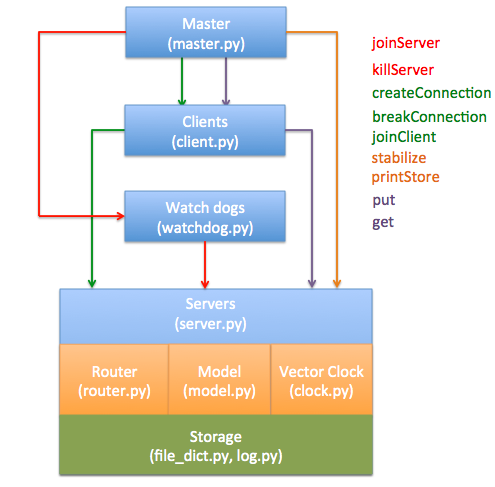

# *Daadkvs* as a Distributed Key-Value Store

We implement a distributed key-value store called *Daadkvs* (**D**aadkvs **a**s **a** 
**D**istributed **K**ey-**V**alue **S**tore). *Daadkvs* implements an eventually consistency model.
Each entry in the store will be a pair of binary strings. The system will consist of clients and servers.
Servers will store the data and perform updates when asked by the clients. Clients will be able
to perform the following operations:

- **Put**:​ a new entry into the store.
- **Get**:​ the value associated with a key

In addition, we provide two session guarantees:

- *Read Your Writes*: if a client has written a value to a key, it will never read an older value.
- *Monotonic Reads*: if a client has read a value, it will never read an older value.

## Implementation

The architecture of our implementation is shown in image below. In the picture, the modules
of the code (i.e., *Master*, *Clients*) are represented by the boxes. The actual source code files
are listed under the module names inside parentheses. The commands are associated with colors of the modules.
For instance, the "Put" command is supported by *Clients* module (i.e., "client.py") and 
*Servers* module (i.e., "server.py"). The semantics of the commands are shown in the table following afterwards. 

| Command                          | Summary                                                                                                                                                                                                                                                                              |
|----------------------------------|--------------------------------------------------------------------------------------------------------------------------------------------------------------------------------------------------------------------------------------------------------------------------------------|
| joinServer [id]                  | This command starts a server and will connect this server to all other servers in the system                                                                                                                                                                                         |
| killServer [id]                  | This command immediately kills a server. It should block until the server is stopped.                                                                                                                                                                                                |
| joinClient [clientId] [serverId] | This command will start a client and connect the client to the specified server.                                                                                                                                                                                                     |
| breakConnection [id1] [id2]      | This command will break the connection between a client and a server or between two servers.                                                                                                                                                                                         |
| createConnection [id1] [id2]     | This command will create or restore the connection between a client and a server or between two servers.                                                                                                                                                                             |
| stabilize                        | This command will block until all values are able to propagate to all connected servers. This should block for a max of 5 seconds for a system with 5 servers.                                                                                                                       |
| printStore [id]                  | This command will print out a server’s key-value store in the format described below.                                                                                                                                                                                                |
| put [clientId] [key] [value]     | This command will tell a client to associate the given value with the key. This command should block until the client communicates with one server.                                                                                                                                  |
| get [clientId] [key]             | This command will tell a client to attempt to get the key associated with the given value. The value or error returned should be printed to standard-out in the format specified below. This command should block until the client communicates with a server and the master script. |

The functionality of each module is following:

- *Master*: a master program which will provide a programmatic interface with the key-value store.
The master program will keep track of and will also send command messages to all servers and
clients. More specifically, the master program will read a sequence of newline delineated
commands from standard input ending with EOF which will interact with the key-value store and,
when instructed to, will display output from the playlist to standard out.

- *Clients*: clients program that invoked by the mater program and perform corresponding commands.
All the commands are implemented using RPC calls. In addition, clients store the vector clock of the 
"Put" command to support *Read Your Writes*.

- *Watch dogs*: each server is guarded by a watch dog which takes command from the master to join the server
he guarded to the network or kill the server.

- *Router*: each server gets a router which is used to find all the available servers that the current
server can reach.

- *Servers*: server works as a RPC server to the clients and works with *Model* to implement the gossip
proctol (i.e., send message and receive message to other servers)

- *Model*: model implements the actual dirty work of the command. Specifically, the module implements
what string to return on "printStore", what to do on "put", and what to return to the requesters on "get".

- *Vector Clock*: as name suggested, the module implements the vector clock and decide the "happen-before"
relationship between two events. 

- *Storage*: the storage layer writes the log and the key-value pairs onto the disk. The storage is used
when one server is killed and revived later.

## Protocol

## Tests and Performance

## How to use our system

## Authors (listed in alphabetical order of last name)

- Jianwei Chen @JianweiCxyz (UT EID: UTCS id: )
- Zeyuan Hu @xxks-kkk (UT EID: zh4378 UTCS id: zeyuanhu)
- Wei Sun @sunwell1994 (UT EID: ; UTCS id: )